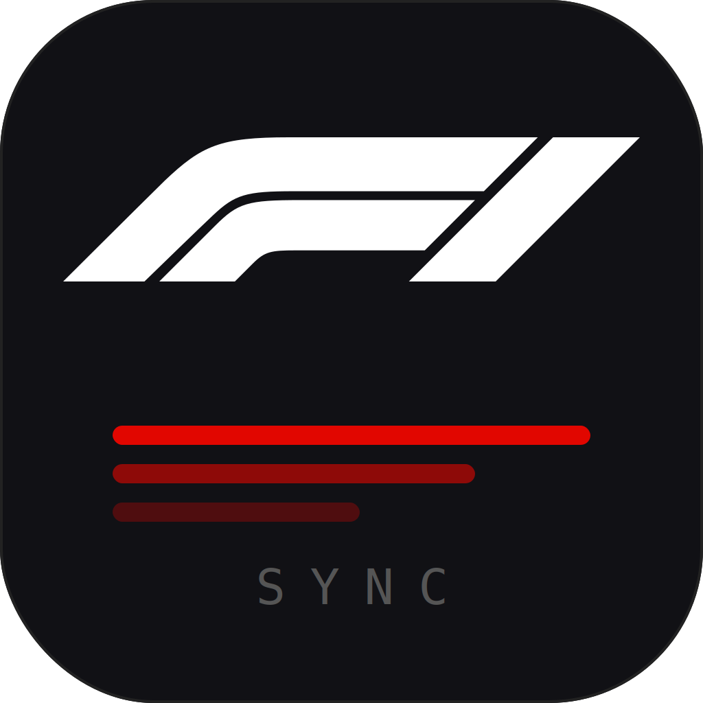
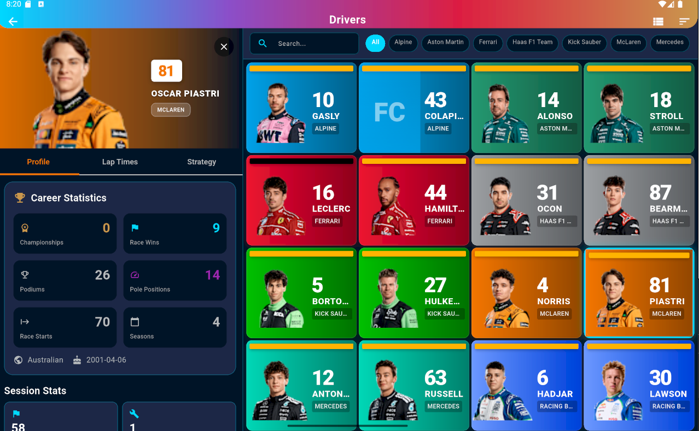

<p align="center">
  
</p>

<h1 align="center">F1Sync</h1>

<p align="center">
  <strong>Your pocket companion for Formula 1</strong><br>
  Driver statistics, race calendar, standings, and session results — powered by the Jolpica F1 API.
</p>

<p align="center">
  
  
  
  
</p>

---

## Screenshots

<p align="center">
  
  &nbsp;&nbsp;
  
  &nbsp;&nbsp;
  
</p>

<p align="center">
  
</p>

---

## Features

| Feature | Description |
|---------|-------------|
| **Home Dashboard** | Current/next Grand Prix, championship leader, quick navigation grid |
| **Grand Prix Calendar** | Browse race calendar by year, view GP details and full session schedules |
| **Drivers** | Complete driver listings with search, team filtering, and sorting |
| **Driver Details** | Career stats (wins, poles, podiums, championships), race history with pagination |
| **Sessions** | Session results and race details |
| **Settings** | Clear cache, app preferences and configuration |

---

## Tech Stack

| Category | Technology |
|----------|------------|
| Framework | Flutter 3.x (Dart SDK >= 3.0.0) |
| State Management | Riverpod + Code Generation |
| Navigation | GoRouter (custom page transitions) |
| HTTP Client | Dio (interceptors, retry, rate limiting) |
| Local Storage | Hive + SharedPreferences |
| Data Serialization | Freezed + JSON Serializable |
| Charts | fl_chart |
| Image Caching | cached_network_image |
| SVG | flutter_svg |
| Environment | flutter_dotenv |

---

## Architecture

The app follows a **feature-first clean architecture** pattern with three layers per feature:

```
lib/
├── core/
│   ├── cache/              # Cache service (memory + disk)
│   ├── config/             # App & API configuration
│   ├── constants/          # API constants, driver assets (2026 grid)
│   ├── error/              # Typed exceptions & error mapping
│   ├── network/            # Jolpica API client, rate limiter, interceptors
│   ├── router/             # GoRouter with fade/slide transitions
│   ├── theme/              # F1 design system (colors, gradients, typography)
│   └── utils/              # Responsive utilities
│
├── features/
│   ├── home/               # Dashboard
│   ├── drivers/            # Driver list & detail
│   ├── meetings/           # GP calendar & detail
│   ├── sessions/           # Session detail & results
│   ├── standings/          # Championship standings (data layer)
│   ├── laps/               # Lap time data (data layer)
│   └── settings/           # App settings
│
├── shared/
│   ├── services/           # Cache, connectivity, haptics, storage
│   └── widgets/            # F1Card, F1Loading, DriverAvatar, etc.
│
└── main.dart
```

Each feature module follows **Clean Architecture**:

```
feature/
├── data/          # Remote data sources, models, repository impl
├── domain/        # Repository interfaces (contracts)
└── presentation/  # Screens, widgets, Riverpod providers
```

---

## API Integration

### Jolpica F1 API

**Base URL:** `https://api.jolpi.ca/ergast/f1`

Successor to the deprecated Ergast API. Provides driver info, race results, standings, circuits, and constructors.

| Endpoint | Description | Cache TTL |
|----------|-------------|-----------|
| `/{season}/drivers` | Drivers in a season | 7 days |
| `/drivers/{id}/results` | Career race results | 7 days |
| `/drivers/{id}/sprint` | Sprint results | 7 days |
| `/drivers/{id}/qualifying` | Qualifying results | 7 days |
| `/{season}/driverStandings` | Driver standings | 7 days |
| `/{season}/constructorStandings` | Constructor standings | 7 days |
| `/{season}` | Season race schedule | 7 days |
| `/{season}/{round}/results` | Race results | 7 days |

**Rate limit:** 200 requests/hour (enforced client-side with request queue serialization and retry logic for 429 errors)

---

## Caching Strategy

Three-layer cache with automatic TTL management:

```
Memory (LRU)  →  Disk (Hive)  →  Network
   ~ms              ~ms            ~seconds
```

| TTL | Duration | Used For |
|-----|----------|----------|
| Short | 1 hour | Current season standings, driver info |
| Long | 7 days | Historical data, race schedules, career stats |
| Permanent | 365 days | Completed race results |

---

## Theme

Custom F1-inspired **dark-only** design system built on Material 3:

| Element | Value |
|---------|-------|
| Background | Navy Deep `#15151E` |
| Surface | Navy `#35353C` |
| Accent | Racing Red `#E10600` |
| Highlight | Gold `#C9974D` |
| Font (Headers) | Formula1 Bold (custom) |
| Font (Body) | Roboto |
| Font (Data) | Roboto Mono |

Includes team-specific colors for all 2026 F1 teams, position colors (P1 gold / P2 silver / P3 bronze), and custom F1 tire loading animation.

---

## Routes

| Route | Screen |
|-------|--------|
| `/` | Home Dashboard |
| `/meetings` | Grand Prix Calendar |
| `/meetings/:meetingKey` | Meeting Detail |
| `/drivers` | Drivers List |
| `/drivers/:driverId` | Driver Detail |
| `/sessions/:sessionKey` | Session Detail |
| `/settings` | Settings |

---

## Getting Started

### Prerequisites

- Flutter SDK >= 3.0.0
- Dart SDK >= 3.0.0

### Installation

```bash
# Clone the repository
git clone https://github.com/GabrielCosta-Abreu/f1-app.git
cd f1-app

# Install dependencies
flutter pub get

# Set up environment
cp .env.example .env

# Generate code (Freezed, Riverpod, JSON serialization)
flutter pub run build_runner build --delete-conflicting-outputs

# Run the app
flutter run
```

### Development

```bash
# Continuous code generation
flutter pub run build_runner watch --delete-conflicting-outputs

# Static analysis
flutter analyze

# Run tests
flutter test
```

---

## Platform Support

- Android
- iOS
- Web
- macOS
- Linux
- Windows

---

## License

This project is for personal/educational use. F1, Formula 1, and related marks are trademarks of Formula One Licensing BV.

## Acknowledgments

- [Jolpica F1 API](https://github.com/jolpica/jolpica-f1) — Historical F1 data (Ergast successor)
- Flutter and Dart teams for the framework
