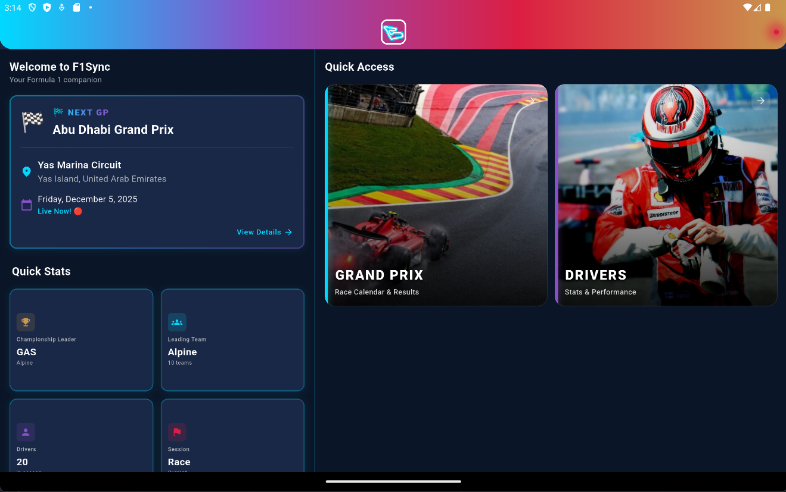
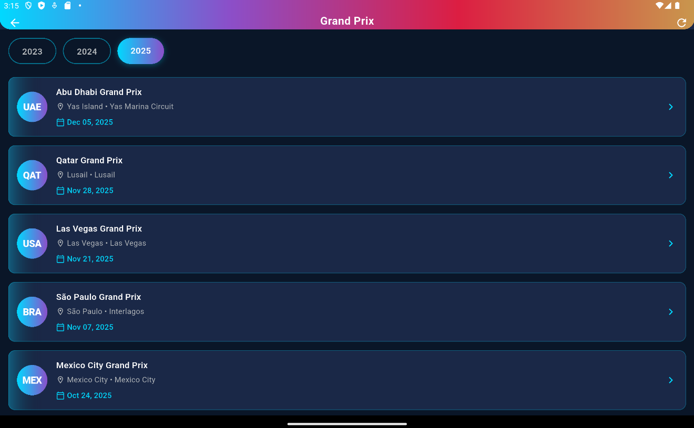
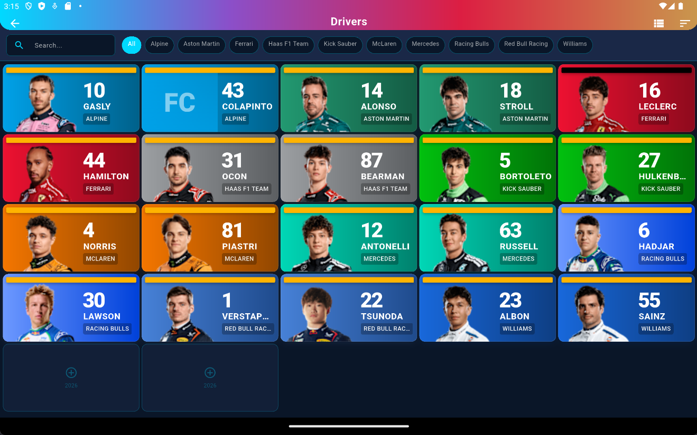

<p align="center">
  
</p>

<h1 align="center">F1Sync</h1>

<p align="center">
  A comprehensive Formula 1 information app built with Flutter, providing real-time race data, driver statistics, and session information using the OpenF1 and Jolpica APIs.
</p>

## Features

### Home Dashboard
Current GP information, quick stats, and navigation to all features.

<p align="center">
  
</p>

### Grand Prix Calendar
Browse race calendar by year, view Grand Prix details and session schedules.

<p align="center">
  
</p>

### Drivers
Complete driver listings with filtering, detailed profiles, and career statistics.

<p align="center">
  
</p>

### Sessions
Live session data including race control messages, weather conditions, and results.

### Lap Times & Stints
Detailed lap time charts and tire strategy visualization.

## Tech Stack

| Category | Technology |
|----------|------------|
| Framework | Flutter 3.x (Dart SDK >=3.0.0) |
| State Management | Riverpod + Code Generation |
| Navigation | GoRouter |
| HTTP Client | Dio with interceptors |
| Local Storage | Hive + SharedPreferences |
| Data Serialization | Freezed + JSON Serializable |
| Charts | fl_chart |
| Image Caching | cached_network_image |

## Architecture

The app follows a **feature-first clean architecture** pattern:

```
lib/
├── core/                    # Core infrastructure
│   ├── cache/              # Caching service
│   ├── config/             # App & API configuration
│   ├── constants/          # API & app constants
│   ├── error/              # Error handling & mapping
│   ├── network/            # API client, interceptors, rate limiting
│   ├── router/             # GoRouter configuration
│   ├── theme/              # F1-themed dark theme (colors, gradients, typography)
│   └── utils/              # Performance monitoring, responsive utilities
│
├── features/               # Feature modules (Clean Architecture per feature)
│   ├── drivers/
│   │   ├── data/          # Data sources & repositories implementation
│   │   ├── domain/        # Repository interfaces
│   │   └── presentation/  # Screens, widgets, providers
│   ├── home/
│   ├── laps/
│   ├── meetings/
│   ├── positions/
│   ├── race_control/
│   ├── session_results/
│   ├── sessions/
│   ├── stints/
│   └── weather/
│
├── shared/                 # Shared resources
│   ├── models/            # Common data models
│   ├── services/          # Cache, connectivity, haptics, storage services
│   ├── utils/             # Date/time utilities, accessibility
│   └── widgets/           # Reusable UI components
│
└── main.dart              # App entry point
```

## API Integration

F1Sync uses two complementary APIs for comprehensive F1 data coverage.

### OpenF1 API (Real-time Data)

The **OpenF1 API** (https://api.openf1.org/v1) provides real-time and current season data with 16 endpoints:

| Endpoint | Description | Cache Strategy |
|----------|-------------|----------------|
| `/drivers` | Driver info & team details | 1 hour |
| `/meetings` | Grand Prix information | 7 days |
| `/sessions` | Session info (FP, Quali, Race) | 1 hour |
| `/laps` | Lap times & sectors | 1 hour |
| `/stints` | Tire strategy data | 1 hour |
| `/position` | Position changes | 5 minutes |
| `/race_control` | Flags & messages | 5 minutes |
| `/weather` | Track conditions | 5 minutes |
| `/session_result` | Final results | Permanent |
| `/car_data` | Telemetry (speed, RPM, etc.) | No cache |
| `/location` | Car track positions | No cache |
| `/intervals` | Gap to leader | No cache |
| `/pit` | Pit stop info | 5 minutes |
| `/team_radio` | Audio clips | 1 hour |
| `/overtakes` | Overtake events (Beta) | 5 minutes |
| `/starting_grid` | Grid positions (Beta) | Permanent |

### Rate Limiting

The app implements client-side rate limiting (60 requests/minute) to respect API guidelines.

### Jolpica API (Historical Data)

For historical career statistics, the app uses the **Jolpica F1 API** (https://api.jolpi.ca/ergast/f1), a continuation of the deprecated Ergast API.

| Endpoint | Description | Cache Strategy |
|----------|-------------|----------------|
| `/drivers/{id}` | Driver biographical info | 7 days |
| `/drivers/{id}/results` | All race results | 7 days |
| `/drivers/{id}/results/1` | Race wins | 7 days |
| `/drivers/{id}/qualifying/1` | Pole positions | 7 days |
| `/{year}/driverstandings` | Season standings | 7 days |
| `/seasons` | All F1 seasons | 7 days |
| `/circuits` | Circuit information | 7 days |
| `/constructors` | Team information | 7 days |

**Used for**: Driver career stats (wins, poles, podiums, championships), historical race results.

**Rate limit**: 200 requests/hour

## Getting Started

### Prerequisites

- Flutter SDK >= 3.0.0
- Dart SDK >= 3.0.0

### Installation

1. **Clone the repository**
   ```bash
   git clone https://github.com/yourusername/f1sync.git
   cd f1sync
   ```

2. **Install dependencies**
   ```bash
   flutter pub get
   ```

3. **Set up environment**
   ```bash
   cp .env.example .env
   ```

   Edit `.env` if needed (default configuration works out of the box):
   ```
   API_BASE_URL=https://api.openf1.org/v1
   API_TIMEOUT=30000
   ENVIRONMENT=development
   ```

4. **Generate code** (for Freezed, Riverpod, JSON serialization)
   ```bash
   flutter pub run build_runner build --delete-conflicting-outputs
   ```

5. **Run the app**
   ```bash
   flutter run
   ```

## App Routes

| Route | Screen | Description |
|-------|--------|-------------|
| `/` | Home | Dashboard with current GP and quick navigation |
| `/meetings` | Meetings History | Race calendar with year selector |
| `/meetings/:meetingKey` | Meeting Detail | GP details and session schedule |
| `/drivers` | Drivers List | All drivers with filtering |
| `/drivers/:driverNumber` | Driver Detail | Driver profile and career stats |
| `/sessions/:sessionKey` | Session Detail | Session data, results, race control |

## Theme

The app features a custom F1-inspired dark theme with:

- **Colors**: Navy deep (#0A1628), Racing red (#FF1801), Championship gold (#FFD700)
- **Gradients**: Team-specific color schemes, F1-branded gradients
- **Typography**: Racing-inspired text styles
- **Team Colors**: Authentic colors for all F1 teams

## Key Components

### Shared Widgets

- `F1Card` - Styled card container
- `F1Loading` - Loading indicators with shimmer effects
- `F1AppBar` - Customized app bar
- `DriverAvatar` - Driver image with headshot caching
- `TeamColorStrip` - Team color accent strips
- `LiveIndicator` - Animated live session indicator
- `OfflineBanner` - Connectivity status banner
- `EmptyStateWidget` - Empty/error state displays

### Services

- `CacheService` - Multi-layer caching (memory + disk via Hive)
- `ConnectivityService` - Network status monitoring
- `HapticService` - Haptic feedback
- `StorageService` - Persistent key-value storage
- `RetryService` - Automatic request retry logic

## Development

### Code Generation

After modifying models or providers with annotations:
```bash
flutter pub run build_runner build --delete-conflicting-outputs
```

For continuous generation during development:
```bash
flutter pub run build_runner watch --delete-conflicting-outputs
```

### Analysis

Run static analysis:
```bash
flutter analyze
```

### Testing

```bash
flutter test
```

## Platform Support

- Android
- iOS
- Web
- macOS
- Linux
- Windows

## License

This project is for personal/educational use. F1, Formula 1, and related marks are trademarks of Formula One Licensing BV.

## Acknowledgments

- [OpenF1 API](https://openf1.org/) for providing free real-time F1 data
- [Jolpica F1 API](https://github.com/jolpica/jolpica-f1) for historical F1 data (Ergast successor)
- Flutter and Dart teams for the amazing framework
